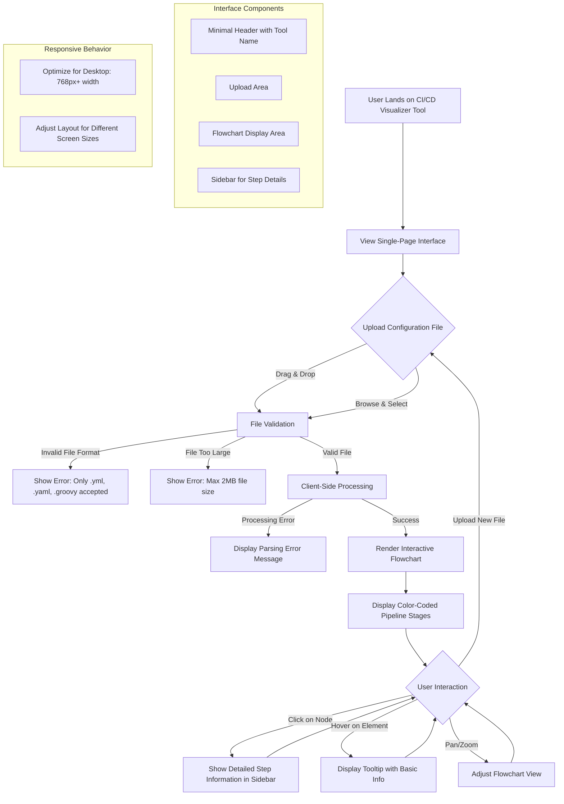

# CI/CD Visualizer: Pipeline Configuration Flowchart Tool

A browser-based tool that transforms CI/CD configuration files (Jenkinsfile, GitHub Actions, GitLab CI) into interactive flowcharts without requiring login, helping teams quickly understand pipeline workflows.

## Features

- **Simple drag-and-drop interface** for uploading configuration files (.yml, .yaml, .groovy) with validation and error handling
- **Interactive flowchart rendering** using Mermaid.js with color-coded nodes representing pipeline stages
- **Clickable nodes** that reveal detailed step information in a sidebar breakdown panel
- **Client-side processing** for privacy (no data storage) with support for files up to 2MB
- **Clean, minimal single-page interface** optimized for desktop viewing (768px+ width)

## Technology Stack

- **Frontend**: React + TypeScript + Vite
- **Visualization**: Mermaid.js for flowchart rendering
- **UI Components**: Radix UI with Tailwind CSS
- **File Handling**: React Dropzone for drag-and-drop functionality
- **Styling**: Tailwind CSS with custom animations

## Project Structure

```
src/
├── components/
│   ├── FileUploader.tsx      # Drag-and-drop file upload component
│   ├── PipelineVisualizer.tsx # Mermaid.js flowchart renderer
│   ├── PipelineBreakdown.tsx  # Sidebar with detailed step information
│   └── home.tsx              # Main application layout
├── lib/
│   └── utils.ts              # Utility functions
└── types/
    └── supabase.ts           # Type definitions
```

## Getting Started

### Prerequisites

- Node.js (v18 or higher)
- npm or yarn

### Installation

```bash
npm install
```

### Development

```bash
npm run dev
```

### Build

```bash
npm run build
```

## Usage

1. **Upload Configuration File**: Drag and drop or browse to select a CI/CD configuration file (.yml, .yaml, .groovy)
2. **View Interactive Flowchart**: The tool automatically parses and renders your pipeline as an interactive flowchart
3. **Explore Pipeline Steps**: Click on any node in the flowchart to view detailed information in the sidebar
4. **Navigate and Zoom**: Use mouse controls to pan and zoom the flowchart for better visibility

## Supported File Formats

- **GitHub Actions**: `.yml`, `.yaml` workflow files
- **GitLab CI**: `.gitlab-ci.yml` files
- **Jenkins**: `Jenkinsfile` (`.groovy` extension)

## Architecture Diagram



## Contributing

1. Fork the repository
2. Create a feature branch
3. Make your changes
4. Add tests if applicable
5. Submit a pull request

## License

MIT License - see LICENSE file for details
